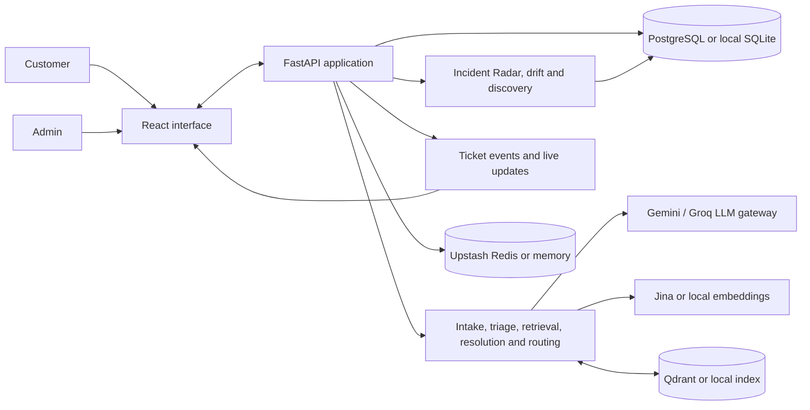

# Resolve Desk

Resolve Desk is a telecom support assistant for customers and admins. It turns a customer's complaint into an issue classification, retrieves similar **resolved** cases and published knowledge-base (KB) guidance, and drafts cited troubleshooting steps. Safe, recurring issues can be tried by the customer; sensitive, severe, or poorly supported issues go to an admin. Tickets retain the conversation, attempted steps, and outcome so a confirmed fix can improve future searches.

The application is **one deployable FastAPI service with a React interface**, organized into intake, retrieval, AI, ticket, and insights modules. It uses external model, vector, and database services when configured. It does not require a separate notification service: updates appear in the ticket dashboard and live event stream.

## Live demo

Open the [deployed Resolve Desk](https://resolve-desk.onrender.com/). These accounts are for the synthetic-data demo:

| Role | Email |
|---|---|
| Customer | `customer@resolvedesk.dev` |
| Admin | `admin@resolvedesk.dev` |

**Password for both accounts:** `Demo-mccjC1wyZIo`

These credentials are intentionally public for judging and should be changed or disabled before using the deployment with real customer data.

## What happens to a complaint

1. A customer registers or signs in, chooses an issue area, and answers adaptive questions when more detail would help. The ticket is saved **before** AI analysis begins.
2. The backend masks common personal identifiers for AI processing. Hybrid search retrieves similar resolved tickets and published KB sections. Unresolved tickets cannot supply resolution evidence.
3. When an LLM provider is configured, it classifies intent, product, severity, and sentiment and drafts steps from the retrieved evidence. Code validates citation IDs, filters unsupported promises, and restricts customer actions to approved self-help guidance. Provider failures trigger conservative fallbacks.
4. The routing policy chooses **self-service** (safe steps for a confident, recurring low-severity issue), **assisted** (customer-safe steps while an admin reviews), or **human** (admin owns the issue). P1, sensitive, unknown, injection-like, and insufficient-evidence cases take the human route. Where reviewed public KB text supports it, an admin-owned ticket may still show brief, read-only precautions.
5. The customer sees their ticket status, conversation, suggested steps, and privacy-safe evidence for AI steps. Admins see the full cited KB articles and past resolved cases, internal diagnostic steps, the ticket history, and a Copilot brief. **Deep Analysis** lets an admin examine another retrieval and draft result without losing it when opening a source.
6. Step outcomes can escalate the same ticket. Admins can ask questions, send messages, and propose a fix. The customer confirms success or reopens the ticket; an admin can also resolve it with a written note. Resolution learning indexes a searchable case and proposes a KB draft when guidance is missing. An admin must review that draft before publication.

**Example:** “My broadband drops each evening; restarting the router did not help.” Intake records the prior restart. Retrieval finds related resolved cases and the broadband guide. If the evidence supports a customer-safe check, the customer may be asked to compare a wired connection with Wi-Fi, with a guide excerpt shown beside the step. If the connection still fails, the ticket moves to the admin queue with the attempted steps attached. The admin can inspect the cited case, ask a question, propose a fix, and receive the customer's confirmation.

Incident Radar separately groups similar recent complaints in one area. The admin sees the incident; linked customers see an in-app notice on their tickets. Resolving an incident proposes a check on each linked open ticket. The system does **not** send email notifications.

## Additional exploration

After signing in as an admin, these areas show how the system reaches and checks its decisions:

- **Ticket Copilot:** open a ticket in the admin queue to inspect its classification, route, suggested steps, citations, and full source details for the retrieved tickets or KB articles.
- **Deep Analysis:** open it from Copilot to analyze that ticket's complaint, or enter a separate complaint. It shows the retrieval, triage, grounded draft, routing reasons, latency, and source details without creating a ticket. Opening a source and returning preserves the analysis result.
- **Taxonomy & discovery:** review low-confidence and unfamiliar complaints, run discovery, and approve or reject proposed issue classes. Approval changes the live taxonomy.
- **Data drift:** inspect changes in complaint mix, retrieval coverage, and the success of previously suggested steps. Alerts can prompt discovery or a KB review.
- **Incident Radar:** inspect groups of similar recent complaints from one area and the tickets linked to an incident.

## Stack

| Layer | Technology |
|---|---|
| Web interface | React 18, JavaScript/JSX, Vite |
| API and domain logic | Python 3.11+, FastAPI, Pydantic, SQLAlchemy |
| System of record | PostgreSQL (Neon when hosted); SQLite locally |
| Search | Qdrant dense + BM25 sparse retrieval, fusion and optional reranking; local index fallback |
| AI providers | Configurable Gemini and Groq chains; optional Anthropic. Jina embeddings/reranker when configured |
| Caching and observability | Upstash Redis or in-memory fallback; Prometheus-format metrics and optional Langfuse traces |
| Operations | Docker, Render blueprint, GitHub Actions |

Authentication uses HttpOnly sessions, server-side customer/admin role checks, ticket ownership checks, and CSRF protection. Server-Sent Events update open dashboards; stored ticket events and messages remain available when a user returns.

For diagrams and design details, see [Architecture](docs/architecture.md).

## Architecture Diagram



The database keeps accounts, tickets, events, and evaluation runs. The search index stores retrievable resolved cases and KB sections; it can be rebuilt from saved data. The AI pipeline runs after a ticket is saved and records its decision and evidence back to the database. See the [detailed architecture](docs/architecture.md) for algorithms and failure paths.

## Dataset

The repository includes an **original synthetic, English-only** dataset:

| File | Count | Used for |
|---|---:|---|
| Resolved historical tickets | 264 | Searchable resolution evidence |
| Unresolved historical tickets | 132 | Intake/discovery data; excluded from resolution evidence |
| KB articles | 22 | Published guidance after seeding |
| Held-out evaluation complaints | 74 | Evaluation inputs, never indexed |
| Update events | 5 | Version and status-change scenarios |

The 22 issue families cover broadband, fiber, Wi-Fi, mobile, SIM/eSIM, billing, plan changes, porting, and TV. Each has 12 resolved tickets, 6 unresolved tickets, and 3 answerable evaluation complaints; 8 additional evaluation complaints are designed to require abstention. Labels and outcomes are generated scenario data, not observed customer outcomes. See the [dataset description](data/synthetic/v1/README.md) and run `python scripts/validate_telecom_dataset.py` to check counts, references, status boundaries, and exact train/evaluation separation.

## Run locally

Prerequisites: **Python 3.11+** and **Node.js 22+**. Copy `.env.example` to `.env`. API keys are optional for a local degraded demo: SQLite, a local vector index, hash embeddings, and memory cache are used when hosted providers are absent. Without an LLM key, tickets still save and route to an admin; AI drafts require a configured model.

**Windows PowerShell**

```powershell
python -m venv .venv
.\.venv\Scripts\python.exe -m pip install -e ".[dev]"
Copy-Item .env.example .env
.\.venv\Scripts\python.exe -m telecom_assistant.cli seed --demo --demo-tickets 6
Push-Location frontend
npm ci
npm run build
Pop-Location
.\.venv\Scripts\python.exe -m uvicorn telecom_assistant.main:app --host 127.0.0.1 --port 8000
```

**macOS / Linux**

```bash
python3 -m venv .venv
.venv/bin/python -m pip install -e ".[dev]"
cp .env.example .env
.venv/bin/python -m telecom_assistant.cli seed --demo --demo-tickets 6
(cd frontend && npm ci && npm run build)
.venv/bin/python -m uvicorn telecom_assistant.main:app --host 127.0.0.1 --port 8000
```

Open **http://127.0.0.1:8000**; API documentation is at **/docs**. The seed command creates demo accounts `customer@resolvedesk.dev` and `admin@resolvedesk.dev` and prints their password when first created. Set `DEMO_PASSWORD` in `.env` before seeding if you want a repeatable password. For frontend development, run `npm run dev` inside `frontend/`; Vite serves port 5173 and proxies API requests to port 8000.

To create an admin without demo accounts, run `python -m telecom_assistant.cli create-user --email you@example.com --role admin` using the environment where the backend is installed; the CLI prompts for a password. For a container run, use `docker compose up --build` after creating `.env`. Hosted setup and data-import steps are in [Deployment](docs/DEPLOYMENT.md).

## Tests and evaluation

```bash
python -m pytest -q
python -m ruff check src tests
python scripts/validate_telecom_dataset.py
cd frontend && npm run build
```

The Python tests use a deterministic fake LLM, SQLite, a hash embedder, and a local vector index, so they run without external API calls. They cover routing and P1 safeguards, citation and privacy gates, authentication/CSRF, the customer–admin lifecycle, learning and restart recovery, provider failure behavior, incident grouping, versioned indexing, and drift signals. GitHub [CI](.github/workflows/ci.yml) also runs lint, tests, dataset validation, frontend build, and a Docker build on pushes and pull requests.

The [saved hosted evaluation report](reports/eval_20261003_195637.md) used the **earlier 56-case** synthetic set (48 answerable, 8 expected abstentions). It reported intent macro-F1 **1.000**, P1 recall **100%**, severity macro-F1 **0.544**, KB Recall@5 **0.979** with hybrid search and reranking, and median/p95 analysis latency **5.4 s / 27.3 s**. It routed 36 cases to human and 20 to assisted, with **no self-service cases** in that run. These results do not establish self-service safety or accuracy on the current 74-case set. A fresh hosted evaluation is needed before making claims about the expanded dataset. The [nightly workflow](.github/workflows/nightly.yml) is configured to run live evaluation, drift, and discovery when its secrets are supplied.

### Evals on System health

An admin can open **System health → Evaluation** to see the newest evaluation run stored in the database. If no run has been saved, the page says so. The hosted evaluation can be started with `python -m telecom_assistant.cli eval --concurrency 1` using the hosted environment, or with **GitHub Actions → nightly → Run workflow** after its required secrets are configured. It writes a report under `reports/` and saves the metrics that the admin page reads.

| Measure | What it checks |
|---|---|
| Intent macro-F1 and P1 recall | Classification across issue classes and detection of the most urgent cases |
| Unsafe self-service routes | Whether a severe or unanswerable complaint was incorrectly offered autonomous steps |
| Citation validity and step support | Whether suggested steps cite allowed evidence and are supported by it |
| KB Recall@5, MRR@10, ticket hit@5 | Whether relevant guidance and similar tickets appear near the top of search results |
| Clarification before/after accuracy | Whether adaptive questions improve intent identification |
| Latency and degraded-mode rates | How long each stage takes and how often a provider fallback is needed |

**Services & quotas** is the other System health tab. It shows database, vector-index and cache status, indexed counts, model quota meters, breaker status, and observed latency for that instance. A displayed evaluation is a snapshot of its recorded run, not a continuously recalculated score.

## Production scale considerations

The deployed design uses one API container and external managed services. The following are scaling steps, not claims that the current deployment already implements them:

| Area | Current design | Change needed at higher volume |
|---|---|---|
| Live updates | In-process Server-Sent Events bus with stored ticket history | Shared pub/sub for multiple API replicas |
| Resolution learning | Background work in the API process with startup recovery | Durable job queue and separate workers |
| Search | Qdrant collections with dense and sparse retrieval | Sharding, replicas, and capacity planning for a much larger corpus |
| Database | PostgreSQL system of record | Backups, retention, partitioning, and read scaling as traffic grows |
| AI capacity | Provider chains, rate limits, quota meters, and cache | Paid capacity and load testing against real traffic patterns |
| Privacy | Regex-based redaction and role-scoped source views | Stronger PII detection, retention rules, and provider agreements for real customer data |

## Operational limits

- The data is synthetic and shares issue templates across training and evaluation. No production accuracy or real-world fix rate has been established.
- The application accepts free-text complaints; a dedicated pre-submission relevance filter for irrelevant text has not been implemented. Unknown or weak-evidence cases route conservatively to an admin and may enter the discovery pool.
- Customer evidence is privacy-filtered, but PII detection is regex-based. Do not use real customer data with third-party providers without suitable agreements and additional review.
- Live events use an in-process bus. Multiple API replicas would need shared pub/sub; the UI can also reload stored ticket data.
- Background resolution learning resumes unfinished work on startup, but it is not a durable external job system. There are no email or off-app notifications.
- The current automated Incident Radar test covers grouping; it does not prove end-to-end delivery to every linked customer screen.

## Repository map

```text
src/telecom_assistant/api/       FastAPI routes, authentication and access control
src/telecom_assistant/tickets/   Ticket lifecycle, persistence, orchestration and live events
src/telecom_assistant/ai/        Intake, triage, cited resolution, Copilot and summarization
src/telecom_assistant/knowledge/ Indexing, retrieval, source details and taxonomy
src/telecom_assistant/insights/  Incident Radar, drift and discovery
src/telecom_assistant/gateways/  Model, embedding, vector and cache integrations
frontend/src/                   Customer and admin interface
data/synthetic/v1/              Synthetic corpus and held-out evaluation inputs
tests/                          Offline regression suite
```
