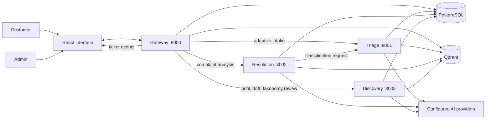

# Resolve Desk

Resolve Desk is a telecom support assistant for customers and admins. It turns a customer's complaint into an issue classification, retrieves similar **resolved** cases and published knowledge-base (KB) guidance, and drafts cited troubleshooting steps. Safe, recurring issues can be tried by the customer; sensitive, severe, or poorly supported issues go to an admin. Tickets retain the conversation, attempted steps, and outcome so a confirmed fix can improve future searches.

The Docker Compose architecture runs four application processes: a customer/admin gateway and separate **Triage**, **Resolution**, and **Discovery** HTTP services. PostgreSQL and Qdrant run as two additional containers. The gateway owns authentication, tickets, customer/admin APIs, Incident Radar, and the React interface; it calls the AI services through versioned internal APIs. The services share the existing domain package, PostgreSQL schema, and Qdrant collections. This is an incremental microservice extraction, with direct-versus-HTTP parity tests for the complaint analysis path. Ticket updates appear in the dashboard and live event stream.

## Live demo

Open the [deployed Resolve Desk](https://resolve-desk.onrender.com/). These accounts are for the synthetic-data demo:

| Role | Email |
|---|---|
| Customer | `customer@resolvedesk.dev` |
| Admin | `admin@resolvedesk.dev` |

**Password for both accounts:** `Demo-mccjC1wyZIo`

These credentials are intentionally public for judging and should be changed or disabled before using the deployment with real customer data.

## What happens to a complaint

1. A customer registers or signs in through the gateway, chooses an issue area, and answers adaptive questions from Triage when more detail would help. The gateway saves the ticket **before** complaint analysis begins.
2. The gateway masks common personal identifiers and sends the complaint to Resolution. Resolution searches similar **resolved** tickets and published KB sections with dense and sparse retrieval. Unresolved tickets cannot supply resolution evidence.
3. Resolution calls Triage with the complaint, retrieved neighbors, and intake answers. Triage classifies intent, product, severity, and sentiment using the live taxonomy, rules, and a configured LLM when available.
4. Resolution drafts evidence-grounded steps, validates citation IDs, filters unsupported promises, and applies the routing policy: **self-service** for a confident, recurring, safe issue; **assisted** for customer-safe steps during admin review; or **human** for admin ownership. P1 cases, including a router with no power, and sensitive, unknown, injection-like, or insufficient-evidence cases take the human route. Provider failures trigger conservative fallbacks. Where reviewed public KB text supports it, an admin-owned ticket may still show brief, read-only precautions.
5. The gateway stores the classification, route, steps, and evidence with the ticket. The customer sees privacy-safe evidence for AI steps; admins can inspect full cited KB articles and past resolved cases, internal diagnostic steps, ticket history, and a Copilot brief. **Deep Analysis** lets an admin examine another retrieval and draft result without losing it when opening a source.
6. Step outcomes can escalate the same ticket. Admins can ask questions, send messages, and propose a fix. The customer confirms success or reopens the ticket; an admin can also resolve it with a written note. Resolution learning indexes a searchable case and proposes a KB draft when guidance is missing. An admin must review that draft before publication.

**Example:** “My broadband drops each evening; restarting the router did not help.” Intake records the prior restart. Retrieval finds related resolved cases and the broadband guide. If the evidence supports a customer-safe check, the customer may be asked to compare a wired connection with Wi-Fi, with a guide excerpt shown beside the step. If the connection still fails, the ticket moves to the admin queue with the attempted steps attached. The admin can inspect the cited case, ask a question, propose a fix, and receive the customer's confirmation.

Incident Radar runs in the gateway and groups similar recent complaints in one area. The admin sees the incident; linked customers see an in-app notice on their tickets. Resolving an incident proposes a check on each linked open ticket. The system does **not** send email notifications. Discovery handles unfamiliar-complaint pooling, drift analysis, and proposed taxonomy changes; an admin approves a new class before it becomes active.

## Additional exploration

After signing in as an admin, these areas show how the system reaches and checks its decisions:

- **Ticket Copilot:** open a ticket in the admin queue to inspect its classification, route, suggested steps, citations, and full source details for the retrieved tickets or KB articles.
- **Deep Analysis:** open it from Copilot to analyze that ticket's complaint, or enter a separate complaint. It shows the retrieval, triage, grounded draft, routing reasons, latency, and source details without creating a ticket. Opening a source and returning preserves the analysis result.
- **Taxonomy & discovery:** review low-confidence and unfamiliar complaints, run discovery, and approve or reject proposed issue classes. Approval changes the live taxonomy.
- **Data drift:** inspect changes in complaint mix, retrieval coverage, and the success of previously suggested steps. Alerts can prompt discovery or a KB review.
- **Incident Radar:** inspect groups of similar recent complaints from one area and the tickets linked to an incident.

## Stack

| Layer | Technology |
|---|---|
| Web interface | React 18, JavaScript/JSX, Vite |
| Gateway and three internal HTTP services | Python 3.11+, FastAPI, Pydantic, SQLAlchemy |
| System of record | PostgreSQL (Neon when hosted); SQLite in offline mode |
| Search | Qdrant dense + BM25 sparse retrieval, fusion and optional reranking; in-memory index fallback |
| AI providers | Configurable Gemini and Groq chains; optional Anthropic. Jina embeddings/reranker when configured |
| Caching and observability | Upstash Redis or in-memory fallback; Prometheus-format metrics and optional Langfuse traces |
| Operations | Docker Compose, GitHub Actions |

Authentication uses HttpOnly sessions, server-side customer/admin role checks, ticket ownership checks, and CSRF protection. Server-Sent Events update open dashboards; stored ticket events and messages remain available when a user returns.

The [microservice architecture](docs/microservices.md) documents service contracts, Docker setup, failure behavior, and remaining gateway dependencies. [Architecture](docs/architecture.md) explains the underlying retrieval, decision, and ticket workflows.

## Architecture Diagram



This diagram describes the **six-container Docker Compose topology**: four application processes plus PostgreSQL and Qdrant. Only the gateway publishes a host port. Internal calls use a shared service token; the gateway retains customer/admin authorization and controls which source details each role can see. PostgreSQL keeps accounts, tickets, events, taxonomy, and evaluation runs. Qdrant holds retrievable resolved cases and KB sections. With internal service URLs unset, the gateway can run the same analysis implementation in-process; that fallback is not an additional container. See the [microservice architecture](docs/microservices.md) for the HTTP contracts and failure paths.

## Dataset

The repository includes an **original synthetic, English-only** dataset:

| File | Count | Used for |
|---|---:|---|
| Resolved historical tickets | 264 | Searchable resolution evidence |
| Unresolved historical tickets | 132 | Intake/discovery data; excluded from resolution evidence |
| KB articles | 22 | Published guidance after seeding |
| Held-out evaluation complaints | 74 | Evaluation inputs, never indexed |
| Update events | 5 | Version and status-change scenarios |

The 22 issue families cover broadband, fiber, Wi-Fi, mobile, SIM/eSIM, billing, plan changes, porting, and TV. Each has 12 resolved tickets, 6 unresolved tickets, and 3 answerable evaluation complaints; 8 additional evaluation complaints are designed to require abstention. Labels and outcomes are generated scenario data, not observed customer outcomes. See the [dataset description](data/synthetic/v1/README.md) and run `python scripts/validate_telecom_dataset.py` to check counts, references, status boundaries, and exact train/evaluation separation.

## Tests and evaluation

```bash
python -m pytest -q
python -m ruff check src tests
python scripts/validate_telecom_dataset.py
cd frontend && npm run build
```

The current regression suite uses a deterministic fake LLM, SQLite, a hash embedder, and an in-memory vector index, so it needs no external API calls. It covers routing and P1 safeguards, citation and privacy gates, authentication/CSRF, the customer–admin lifecycle, learning and restart recovery, provider failure behavior, incident grouping, versioned indexing, and drift signals. On 6 October 2026, `pytest` reported **37 passed** (two warnings), the dataset validator passed, and the React production build succeeded. GitHub [CI](.github/workflows/ci.yml) runs lint, tests, dataset validation, frontend build, and Docker build on pushes and pull requests.

The current evaluation corpus contains **74 held-out English complaints** across 22 issue families, including 8 cases designed to test abstention. The evaluator runs these through the configured retrieval and AI pipeline, writes a report, and stores the run for the admin console. The [nightly workflow](.github/workflows/nightly.yml) is configured to run evaluation, drift detection, and discovery when its hosted-service secrets are supplied. Run-specific accuracy figures appear in **System health → Evaluation** after an evaluation completes.

A full Docker service-to-service evaluation on 6 October 2026 found **100% P1 recall across nine urgent cases** after the router power-loss fix, with no unsafe self-service routes. Severity macro-F1 was **0.586**, below the 0.70 development target. The synthetic gold labels and the written severity rubric disagree on some P2/P3 cases and on porting cases where both SIMs are dead, so those labels need human review before the score can serve as a release gate. These figures describe synthetic cases with hash embeddings, not production accuracy on the hosted system.

### Evals on System health

An admin can open **System health → Evaluation** to see the newest evaluation run stored in the database. If no run has been saved, the page says so. The hosted evaluation can be started with `python -m telecom_assistant.cli eval --concurrency 1` using the hosted environment, or with **GitHub Actions → nightly → Run workflow** after its required secrets are configured. It writes a report under `reports/` and saves the metrics that the admin page reads.

| Measure | What it checks |
|---|---|
| Intent macro-F1 and P1 recall | Classification across issue classes and detection of the most urgent cases |
| Unsafe self-service routes | Whether a severe or unanswerable complaint was incorrectly offered autonomous steps |
| Citation validity and step support | Whether suggested steps cite allowed evidence and are supported by it |
| KB Recall@5, MRR@10, ticket hit@5 | Whether relevant guidance and similar tickets appear near the top of search results |
| Clarification before/after accuracy | Whether adaptive questions improve intent identification |
| Latency and degraded-mode rates | How long each stage takes and how often a provider fallback is needed |

**Services & quotas** is the other System health tab. It shows database, vector-index and cache status, indexed counts, model quota meters, breaker status, and observed latency for that instance. A displayed evaluation is a snapshot of its recorded run, not a continuously recalculated score.

## Production scale considerations

The Docker Compose topology separates the gateway, triage, resolution, and discovery processes, but they still share PostgreSQL, Qdrant, and Python domain code. The following are scaling steps, not claims that the current design already implements them:

| Area | Current design | Change needed at higher volume |
|---|---|---|
| Service boundaries | Four HTTP application processes with shared data stores | Independent data ownership and narrower service dependencies where useful |
| Live updates | Gateway's in-process Server-Sent Events bus with stored ticket history | Shared pub/sub for multiple gateway replicas |
| Resolution learning | Background work in the gateway process with startup recovery | Durable job queue and separate workers |
| Search | Qdrant collections with dense and sparse retrieval | Sharding, replicas, and capacity planning for a much larger corpus |
| Database | PostgreSQL system of record | Backups, retention, partitioning, and read scaling as traffic grows |
| AI capacity | Provider chains, rate limits, quota meters, and cache | Paid capacity and load testing against real traffic patterns |
| Privacy | Regex-based redaction and role-scoped source views | Stronger PII detection, retention rules, and provider agreements for real customer data |

## Operational limits

- The data is synthetic and shares issue templates across training and evaluation. No production accuracy or real-world fix rate has been established.
- The current automated Incident Radar test covers grouping; it does not prove end-to-end delivery to every linked customer screen.

## Repository map

```text
src/telecom_assistant/api/       FastAPI routes, authentication and access control
src/telecom_assistant/tickets/   Ticket lifecycle, persistence, orchestration and live events
src/telecom_assistant/ai/        Intake, triage, cited resolution, Copilot and summarization
src/telecom_assistant/knowledge/ Indexing, retrieval, source details and taxonomy
src/telecom_assistant/insights/  Incident Radar, drift and discovery
src/telecom_assistant/gateways/  Model, embedding, vector and cache integrations
src/telecom_assistant/microservices/  Internal HTTP apps, clients and contracts
services/                       Triage, resolution and discovery Dockerfiles
docker-compose.yml              Gateway, three AI services, PostgreSQL and Qdrant
frontend/src/                   Customer and admin interface
data/synthetic/v1/              Synthetic corpus and held-out evaluation inputs
tests/                          Offline regression suite
```
