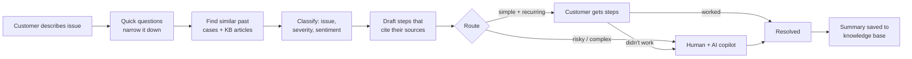

# Interview guide: explaining Resolve Desk

This guide explains the whole system in plain language so you can present it and answer questions about it.
The detailed design is in [architecture.md](architecture.md); this page is the version you say out loud.

---

## 1. The pitch

**30 seconds.**
> Telecom support teams waste time re-solving problems that were already solved, because keyword search can't
> find past tickets written in different words. I built a support system that understands a complaint by
> meaning, fixes simple and recurring issues itself with grounded, cited steps, and sends complex or risky ones
> to a human with an AI copilot. A ticket stays open until the customer confirms the fix, and every resolution
> is added to the knowledge base, so the system gets better over time.

**2 minutes:** add one sentence for each item in section 3, then quote the numbers in section 6.

---

## 2. The problem

- Customers describe the same issue in many ways: "internet drops at night", "WiFi cuts out after 7pm",
  "line sync lost during peak hours". Keyword search misses these matches.
- Admins waste time on repeat issues, answer quality varies, and customers repeat themselves at every handoff.
- The goal is to **solve the easy cases instantly and safely, and make the hard cases faster for humans**,
  without the AI ever making things up or promising things it can't deliver.

---

## 3. One ticket's journey

1. **Intake.** The customer picks a topic chip (Swiggy-style), writes a sentence in their own words, and answers
   2–4 quick questions. Each question is the one that rules out the most possibilities.
2. **Search.** The system finds the most similar *resolved* past tickets and knowledge-base (KB) articles, by
   meaning and by keywords.
3. **Classify.** An LLM labels the issue type, product, severity (P1–P4) and sentiment. It is checked against
   what similar past tickets were labelled, and simple rules make sure outages are always marked P1.
4. **Draft.** A second LLM call writes steps **only from the retrieved sources**, and every step must cite one.
   Code then deletes any step whose citation is fake, and any promise like "refund in 2 days".
5. **Route.** There are three outcomes:
   - **Self-service:** low severity, confident, solved at least 3 times before, and a safe step exists.
   - **Assisted:** safe steps *and* a human reviews the ticket.
   - **Human:** P1, sensitive (billing, identity, porting), unclear, or a suspicious prompt.
6. **Steps.** The customer ticks "worked / didn't work" on each step and can open a chat for any step. If every
   step fails, the ticket goes to a human automatically, along with everything that was tried.
7. **Human loop.** The admin sees a copilot brief (similar past incidents, likely causes, next actions), can ask
   the customer a question with tap-to-answer choices, and proposes a fix. The customer confirms it or says
   "still not working", which reopens the **same** ticket.
8. **Learning.** Once resolved, an LLM summarises the whole ticket, and the summary is immediately searchable as
   a new past case. If the fix was new, it becomes a KB draft that an admin approves.
9. **Updates.** The ticket timeline and live event stream show status changes, messages and incident notices.

---

## 4. Each component in one paragraph

**Adaptive questions (information gain), `ai/clarify.py`.**
The engine keeps a probability for each of the 22 seeded issue types. For every candidate question, it works out how
much the question would reduce uncertainty on average (entropy before minus expected entropy after) and asks
the best one. After each answer it updates the probabilities with Bayes' rule, and it stops at 80% confidence.
The questions live in a JSON file, so adding one needs no code change. This step makes no LLM call: it is pure
maths, so it is fast, free and explainable.
*Why:* a fixed form asks irrelevant questions, and an LLM chatbot is slow and hard to test.

**Hybrid search, `knowledge/retrieval.py`.**
Each ticket and each KB section is stored twice in Qdrant: as a meaning vector (Jina embeddings) and as keyword
weights (BM25). Both searches run, and the two ranked lists are merged with Reciprocal Rank Fusion. Tickets
whose fixes customers confirmed get a small boost. A reranker model then reorders the top results.
*Why both:* meaning search handles paraphrases and typos; keyword search handles exact terms like "LOS" or
error codes.

**Classification, `ai/triage.py`.**
The LLM receives the *current* list of issue types (read from the database), so a new issue type needs no
retraining. The final confidence combines the LLM's confidence, agreement with similar past tickets (k-NN),
and the customer's intake answers. Deterministic rules add safety on top. For example, "whole street has no
internet" or a red LOS light always makes the ticket P1.

**Grounded drafting, `ai/resolver.py`.**
The LLM may only use the supplied sources, and every step must cite one. Code enforces this, not just the
prompt:

- citations that weren't in the sources are deleted, and uncited steps are dropped;
- unsupported promises (refunds, deadlines) are filtered out;
- a step shown to the *customer* must cite a "customer self-help" section of the KB, so admin-only actions
  like "reprovision the line" can never reach the customer.

**Routing, `ai/resolver.py::route`.**
Every decision is a list of plain-English reasons ("P1 severity always goes to a human", "Only 1 similar past
case"). Admins see the reasons, and customers see a friendly version.

**Ticket lifecycle, `tickets/lifecycle.py` and `tickets/desk.py`.**
A small state machine: analyzing → self_service / escalated → in_progress → awaiting_customer →
solution_proposed → resolved. Illegal moves are rejected. Every change writes an event, which forms both the
audit trail and the customer's timeline.

**Live updates, `tickets/events.py`.**
Ticket changes are stored in the timeline. The event bus pushes updates to connected dashboards so customers
and admins can follow the same ticket. Incident Radar adds a message to every linked ticket.

**Copilot, `ai/assistants.py`.**
For escalated tickets, the LLM reads the timeline, the steps the customer tried and failed, and similar
incidents. It suggests root causes, next actions (excluding what already failed), questions to ask and a reply
draft, all cited.

**Data drift, `insights/drift.py`.**
It watches four things:

- **Has the mix of issues changed?** PSI on the issue distribution.
- **Are complaints unlike anything we've seen?** The out-of-distribution rate: the closest past case is too far
  away.
- **Are tickets not fitting any issue type?** The "other" rate. If it is high, a discovery job clusters those
  tickets and proposes a new issue type for an admin to approve.
- **Have known fixes stopped working?** "Solution drift": the success rate of each KB article's steps, from
  customers' ticks. If a fix starts failing, the article is flagged for review.

**Incident radar, `insights/incidents.py`.**
When 3 or more similar tickets arrive from the same area within 6 hours, they are grouped into one incident.
Those customers are told "known issue in your area", and the admin resolves the incident once for everyone.

**LLM gateway, `gateways/llm.py`.**
Each job has an ordered list of models (e.g. Gemini, then Groq). If a model errors, returns invalid JSON or is
rate-limited, the next model is used. Calls are paced to the free-tier limits (requests and tokens per minute).
If every model is down, the ticket is still saved and goes to a human; nothing is lost.

---

## 5. Design decisions you should be able to defend

| Decision | Why | Alternative rejected |
|---|---|---|
| Retrieval-grounded LLM (RAG), not fine-tuning | New fixes are usable as soon as they're indexed; every answer is traceable to a source | Fine-tuning: slow to update, can't cite |
| Citations validated **in code** | Prompts can be ignored; code can't | Trusting the prompt |
| Three routes, not "AI vs human" | Borderline cases still get safe help while a human looks | Binary routing wastes either customer or admin time |
| Customer steps must cite self-help sections | The model can't reliably tell safe actions from admin-only ones; the KB can | Letting the LLM decide what's safe |
| Intake by information gain, no LLM | Deterministic, testable, explainable, free | LLM chat interview: slow, costly, unpredictable |
| Postgres is the source of truth; vectors are derived | A lost vector index can be rebuilt from the database with cached embeddings | Treating the vector DB as the only copy |
| Ticket timeline and event stream | Status and messages stay visible in the product | Requiring a page refresh for every update |
| Learned summaries auto-indexed, KB articles need approval | Fast learning, without unreviewed text becoming official advice | Auto-publishing everything |
| Live taxonomy in the database | New issue types without code changes or retraining | Hard-coded labels |

---

## 6. Numbers to quote

From the earlier `reports/eval_20261003_195637.md`: 56 held-out English test complaints (never indexed), synthetic data. The current corpus has 74 held-out cases and has not yet had the same hosted evaluation rerun.

| What | Result |
|---|---|
| Issue classification (macro-F1) | 1.00 (100%) |
| P1 (critical outage) recall | 100% |
| Unsafe automated answers on critical or unclear cases | 0 |
| Steps citing a real source / judged as supported by an independent LLM | 100% / 100% |
| Finding the right KB article in the top 5 (hybrid + rerank) | 97.9% (keyword-only: 81%) |
| Accuracy from complaint alone → after questions | 93.8% → 100% |
| Unclear complaints correctly sent to a human (abstention recall) | 100% |
| Typical response time | ~5–6 s |

**Be honest about these:**

- Severity F1 is 0.54 (target 0.70). Critical outages are always caught; the misses are medium vs low priority.
- p95 latency is ~25 s, caused by free-tier per-minute limits.
- The data is synthetic, so these numbers are a development baseline, not production accuracy.

---

## 7. Bugs I found and fixed (great interview stories)

1. **The rate-limit storm.** The first evaluation showed 70% of cases running without the AI.
   - *Cause:* I ran 3 cases in parallel. Gemini's free tier allows 15 requests per minute and Groq's 8,000
     tokens per minute. The 429 errors tripped my circuit breakers, which then blocked both providers.
   - *Fix:* pace calls per model, treat 429 as "wait", not "broken", and add more models with separate quotas.
   - *Result:* the degraded rate went from 70% to 1.8%, and P1 recall from 50% to 100%.
2. **"Not sure" was being counted as evidence.** A unit test showed that answering "I'm not sure" changed the
   probabilities. *Fix:* give a neutral answer equal likelihood under every issue type, so it carries no
   information.
3. **The white page.** The page went blank after a chat message.
   - *Cause:* a React effect written as `useEffect(() => el.scrollIntoView())` returns whatever
     `scrollIntoView` returns. Newer Chrome returns a Promise, and React tried to call it as a cleanup function.
   - *Fix:* braces, plus error boundaries so any future crash shows a recovery screen.
4. **Gemini refused to answer (`RECITATION`)** when steps copied the KB word for word. *Fix:* fail over
   immediately instead of retrying, tell the model to paraphrase, and make the faster, more reliable model the
   primary for drafting, a choice based on measurement.
5. **Wrong article cited.** A Wi-Fi complaint got steps from the "connection drops" article. *Fix:* always load
   the article for the *classified* issue first.

---

## 8. Scaling to production

- **API servers** are stateless: add more of them behind a load balancer.
- **Vector search:** Qdrant supports sharding and replication. int8 quantisation cuts memory about 4×
  (≈10 GB for 10M tickets).
- **LLMs:** switch free tiers to paid tiers (config only). Cache prompts, and route easy tickets to cheaper
  models.
- **Learning:** background after resolution; the indexer is idempotent (versioned, content-hashed) and
  unfinished summaries resume at startup.
- **Live updates:** today they run in-process; in production they move to Redis pub/sub so every server can
  push them.
- **Changing the embedding model:** build new collections, then atomically switch an alias (blue/green, zero
  downtime). Embeddings are cached, so the rebuild costs nothing.

---

## 9. Likely interview questions

**Q: How do you stop the AI from hallucinating?**
Four layers:

1. It only sees retrieved sources.
2. Every step must cite one, and code deletes steps with invalid citations.
3. A filter blocks unsupported promises.
4. If evidence is weak, the system abstains and routes to a human.

The eval also checks every step with a *different* LLM as a judge.

**Q: How do you decide what's "simple"?**
All four conditions must hold:

- severity P3/P4;
- triage confidence ≥ 0.62;
- the same issue solved at least 3 times before (recurrence);
- at least one customer-safe step backed by a self-help article.

On top of that there are hard blockers: P1, sensitive topics, unknown issue types and prompt-injection attempts
always go to a human.

**Q: What if the LLM provider is down?**
The gateway tries the next model. If all are down, triage falls back to similar-ticket votes plus rules, the
ticket is saved, and a human gets it. Customers never lose a ticket.

**Q: How does the system learn?**
Two ways:

1. Every resolved ticket becomes a searchable past case immediately, and novel fixes become KB drafts.
2. Customers' "worked / didn't work" ticks raise or lower how strongly the cited past tickets are ranked in
   future searches.

**Q: How do you handle a brand-new type of issue?**
It lands in a discovery pool: tickets labelled "other", low-confidence ones, and ones unlike anything seen
before. A job clusters them, an LLM names each cluster, and an admin approves it. Approval adds it to the live
taxonomy, so the next ticket can be classified as the new type with no retraining.

**Q: Why ask questions instead of just using the LLM?**
They are cheaper, faster and measurable. Intent accuracy goes from 93.8% to 100% with about 3–4 taps, and the
UI shows the uncertainty dropping.

**Q: What is PSI?**
The Population Stability Index measures how much a distribution has shifted between two periods. Above 0.2
means a significant shift, for example a sudden rise in outage tickets.

**Q: What is Reciprocal Rank Fusion?**
A simple way to merge two ranked lists: each item scores 1/(60 + its rank) in each list, and the scores are
added. It works without needing comparable scores from the two searches.

**Q: How is privacy handled?**
Phone numbers, emails, card numbers and account numbers are redacted before any AI call, log or trace. The raw
text stays only in the ticket database, visible to the customer and admins.

**Q: How do you test something that uses an LLM?**
Two levels:

- **Tests:** a fake, deterministic LLM, a hash-based embedder and SQLite, so the tests run offline in CI at
  zero cost.
- **Evaluation:** a separate harness runs the real models on 74 held-out cases and reports accuracy, safety,
  retrieval quality and latency.

**Q: What would you do next?**

- Real (non-synthetic) labelled data.
- Better severity accuracy on the P2/P3 boundary.
- An NER-based PII detector.
- Redis pub/sub for multi-server live updates.

---

## 10. Glossary

| Term | Meaning |
|---|---|
| Intent | The issue type, e.g. `connectivity.intermittent_drop` |
| Embedding | A vector that captures a text's meaning, so similar meanings land close together |
| BM25 | Classic keyword-relevance scoring |
| k-NN vote | Look at the k most similar past tickets and see which issue types they had |
| Entropy / bits | How uncertain we are; each good question removes some bits |
| RAG | Retrieval-augmented generation: the LLM answers from retrieved documents |
| Abstain | The AI deliberately gives no answer when evidence is weak |
| Circuit breaker | Stop calling a failing service for a while instead of hammering it |
| PSI | Population Stability Index: measures distribution shift |
| OOD | Out of distribution: unlike anything in the training or indexed data |

---

## 11. Where things are in the code

| Topic | File |
|---|---|
| Whole ticket flow (start here) | `src/telecom_assistant/tickets/desk.py` |
| Adaptive questions | `src/telecom_assistant/ai/clarify.py`, `resources/questions.json` |
| Classification + severity rules | `src/telecom_assistant/ai/triage.py` |
| Grounding + routing | `src/telecom_assistant/ai/resolver.py` |
| Search | `src/telecom_assistant/knowledge/retrieval.py` |
| Live ticket updates | `src/telecom_assistant/tickets/events.py` |
| Drift / discovery / incidents | `src/telecom_assistant/insights/` |
| LLM failover + rate limits | `src/telecom_assistant/gateways/llm.py` |
| HTTP API | `src/telecom_assistant/api/app.py` |
| Customer screens | `frontend/src/pages/customer/` |
| Admin screens | `frontend/src/pages/admin/` |
| Evaluation | `src/telecom_assistant/evaluation.py`, `reports/` |
