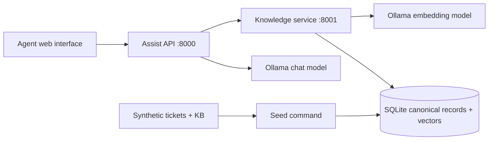

# Basic Architecture and Decision Record

## Scope

An agent enters a complaint. The assist API classifies intent, category, product, severity and sentiment; obtains similar resolved tickets and published KB articles; drafts cited steps from those sources; and returns an evidence or abstention decision. The agent reviews the result. The current scope is a local MVP with production-oriented boundaries, not a deployed multi-user service.

## Decision: one canonical store, two logical ticket pools

The SQLite `records` table is the source of truth. Ticket status is `unresolved` or `resolved`; KB status is `published` or `deprecated`. Search selects eligible records **before** cosine ranking. Resolution search sees only resolved tickets and published articles. A separate unresolved pool is available for analysis but never supplies draft evidence. Versioned upsert changes a record in place, so a ticket moving from unresolved to resolved keeps its ID and can never exist as two contradictory copies. A database index on kind, status and embedding model supports the pool filter.

This is simpler than two physical databases for the first phase. The table and vector scan can later be replaced with separate Qdrant collections without changing the service API. SQLite cosine scanning is appropriate for this small corpus; latency and scale must be measured before making production claims.

## Request flow

1. `POST /v1/resolve` validates a 5–5000 character complaint.
2. Assist obtains the live taxonomy from Knowledge. The chat model returns structured triage. Unknown intents map to `other`.
3. Assist searches resolved tickets and KB separately by semantic embedding. If the top three resolved tickets agree strongly on an intent that differs from the small model, it adjusts intent, category and product. Narrow total-service-loss and recurring-impact rules can raise severity; adjustments are returned in `warnings`.
4. A configurable score gate retains candidate sources. The chat model receives only these sources and returns numbered steps with IDs.
5. Assist removes citations absent from the retrieved set and drops steps left without citations. If no supported steps remain, it returns `insufficient_evidence` with the sources.
6. The interface displays triage, sources, draft, warnings and trace ID for agent review.

The model cannot prove that a step is supported merely by naming a valid source. Citation-support evaluation is a known next-phase gap. The local CPU model may take about a minute per complaint in the tested setup, so the interface describes that wait honestly.

## Ingestion and evolving classes

`python -m telecom_assistant.seed bootstrap` loads the synthetic corpus and taxonomy. The Knowledge API also accepts one versioned record at a time via `POST /v1/records`, with stale and same-version conflicting updates rejected. `POST /v1/taxonomy` can add or revise a class; Assist reads current classes on each request. The update fixture exercises resolution transitions and KB status changes. There is no automatic drift detector, class discovery job or event queue yet.

## Current risks and follow-up work

The dataset is templated and synthetic. Severity and sentiment depend on a small local model plus narrow rules and need measured evaluation. The minimum similarity threshold is an uncalibrated default. SQLite vector search scans matching rows in Python. Citation validation checks IDs but not factual support. There is no authentication, tenant isolation, PII redaction, feedback store, persistent trace store, observability backend or high-availability deployment. These are documented gaps, not capabilities claimed by the MVP.
