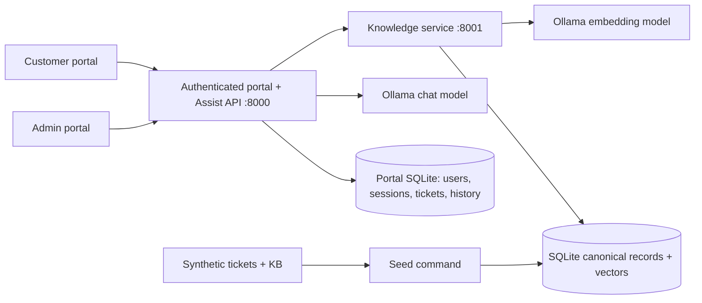

# Basic Architecture and Decision Record

## Scope

A customer signs in and raises a ticket. The portal saves it before analysis. The Assist API classifies intent, category, product, severity and sentiment; obtains similar resolved tickets and published KB articles; drafts cited steps; and returns an evidence or abstention decision. Safe, low-severity customer checks are selected from actionable KB lines, while an admin can review every ticket and the full analysis. The current scope is a localhost prototype with explicit authorization boundaries, not a deployed multi-user service.

## Decision: one canonical store, two logical ticket pools

The SQLite `records` table is the source of truth. Ticket status is `unresolved` or `resolved`; KB status is `published` or `deprecated`. Search selects eligible records **before** cosine ranking. Resolution search sees only resolved tickets and published articles. A separate unresolved pool is available for analysis but never supplies draft evidence. Versioned upsert changes a record in place, so a ticket moving from unresolved to resolved keeps its ID and can never exist as two contradictory copies. A database index on kind, status and embedding model supports the pool filter.

This is simpler than two physical databases for the first phase. The table and vector scan can later be replaced with separate Qdrant collections without changing the service API. SQLite cosine scanning is appropriate for this small corpus; latency and scale must be measured before making production claims.

## Request flow

1. A customer signs in and calls `POST /v1/tickets`; the portal checks the session role and CSRF token, validates a 5–5000 character complaint, and saves the ticket immediately. Common emails and long numbers are redacted in the copy sent to local models/search, while the raw complaint remains available to the admin in the local portal database.
2. Assist obtains the live taxonomy from Knowledge. The chat model returns structured triage. Unknown intents map to `other`.
3. Assist searches resolved tickets and KB separately by semantic embedding. If the top three resolved tickets agree strongly on an intent that differs from the small model, it adjusts intent, category and product. Narrow total-service-loss and recurring-impact rules can raise severity; adjustments are returned in `warnings`.
4. A configurable score gate retains candidate sources. The chat model receives the strongest three resolved tickets and two KB articles, with KB first, and returns numbered steps with IDs.
5. Assist removes citations absent from the retrieved set and drops steps left without citations. If no supported steps remain, it returns `insufficient_evidence` with the sources.
6. The admin interface displays raw ticket details, triage, sources, draft, warnings, timing, trace ID and all previous analysis runs. The customer sees status and a public note. Only P3/P4 steps matched to an actionable published KB check line are shown as basic self-help; the portal displays the KB check wording and the supporting line rather than an unsupported paraphrase.

## Authentication and ticket permissions

Customer registration always assigns the `customer` role. Admin accounts are created only through a local password-prompting CLI. Passwords use salted scrypt hashes. Login creates a random server-stored session identified by an HttpOnly SameSite=Strict cookie; browser mutations also require a CSRF token. Five wrong password attempts lock that account for ten minutes. Every customer and admin API checks session and role on the server; ticket reads and feedback also check the owner. The Knowledge API and direct Assist analysis API require a separate random service token kept under ignored `.runtime/`. This is for localhost use; it does not replace TLS, reverse-proxy policy, MFA or production identity management.

The portal stores status transitions, feedback, analysis attempts and model failures. An AI outage does not discard a submitted ticket; its state becomes `needs_review`, and an admin can retry analysis. A small dashboard reports recent unknown-intent and abstention rates as a heuristic drift signal and exposes local Ollama/Knowledge readiness. It does not automatically learn a class or guarantee model availability.

The model cannot prove that a step is supported merely by naming a valid source. The customer gate now requires a similar KB check line, but lexical matching and a few synonyms are not a semantic entailment test. Citation-support evaluation remains a next-phase gap. The local CPU model can take around a minute or more per complaint, so the interface describes that wait honestly.

## Ingestion and evolving classes

`python -m telecom_assistant.seed bootstrap` loads the synthetic corpus and taxonomy. The Knowledge API also accepts one versioned record at a time via `POST /v1/records`, with stale and same-version conflicting updates rejected. `POST /v1/taxonomy` can add or revise a class; Assist reads current classes on each request. The update fixture exercises resolution transitions and KB status changes. There is no automatic drift detector, class discovery job or event queue yet.

## Current risks and follow-up work

The dataset is templated and synthetic. Severity and sentiment depend on a small local model plus narrow rules and need independent evaluation. The similarity gates and KB-line matching are development heuristics. SQLite vector search still scans matching rows in Python. Portal authentication is local and single-tenant; there is no MFA, password reset, TLS deployment, tenant isolation, comprehensive PII detection, enterprise audit backend, vector index or high availability. Common email and long-number masking is partial. Model and service outages fall back to a saved ticket for human review; no software can guarantee an LLM response when its runtime or hardware is unavailable.
