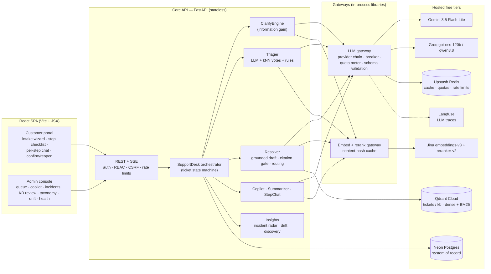
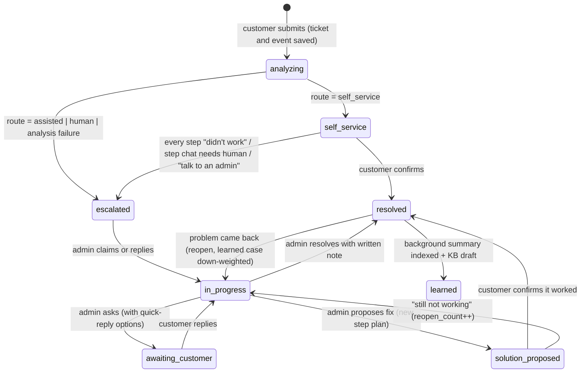
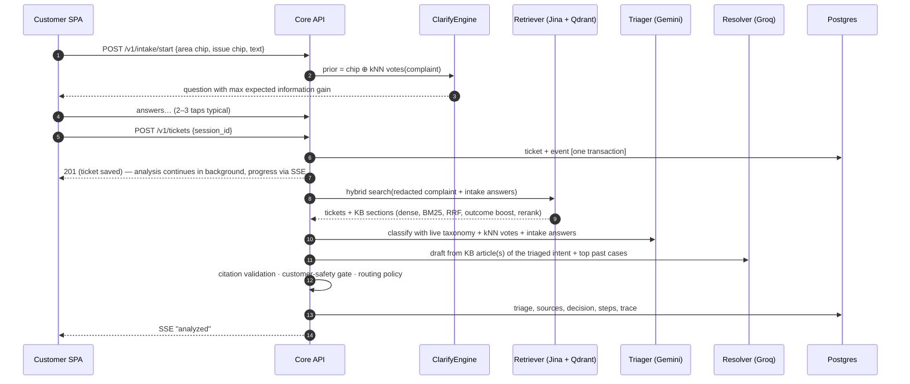
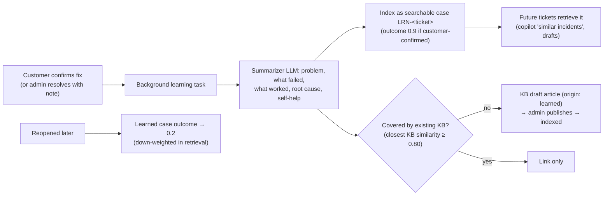

# Architecture and Design Decisions

Resolve Desk is a telecom support system that works out what is wrong, fixes simple and recurring issues
itself with grounded steps, and sends complex ones to admins with an AI copilot. A ticket can be resolved
when the customer confirms a fix or when an admin records a resolution note. Resolved cases become searchable;
new canonical knowledge-base articles require admin review before publication.

This document covers the system, the main flows, the algorithms behind each decision, how it scales, and the
alternatives that were considered.

## 1. System overview



**Boundaries.** Online work runs on request: intake, analysis, conversation. Knowledge learning runs in a
background task after resolution, and unfinished learning is resumed at startup. The gateways are libraries,
not services, to avoid extra network hops. Their state (quota counters, cache) lives in
Upstash, so every replica sees the same values.

**Graceful degradation.**

| Component down | Behaviour |
|---|---|
| One LLM provider | The next provider in the chain is used |
| All LLM providers | Triage falls back to kNN + intake signals. The ticket goes to a human, nothing is lost. |
| Jina embeddings | Sparse BM25-only retrieval |
| Reranker | Results stay in RRF order |
| Upstash | In-memory cache and quotas |

Every degradation is recorded in the trace and shown to admins.

## 2. Ticket lifecycle



Transitions are enforced in `tickets/lifecycle.py`; an illegal transition returns HTTP 409. Every change
writes a `ticket_events` row, which is the audit trail and the customer's timeline.

## 3. Request flow: analysis



Typical warm latency on free tiers (measured): retrieval ~0.75 s, triage ~1.5 s, draft ~2 s, about 5 s in
total, with the customer's ticket saved and acknowledged before any of it starts.

## 4. Key algorithms

### 4.1 Adaptive intake by expected information gain
`ai/clarify.py` keeps a posterior over the live taxonomy intents. The prior mixes the customer's chip choice
with similarity-weighted votes from the 10 nearest resolved tickets (kNN). The kNN weight drops when the
complaint is out of distribution. For each candidate question `q`, the engine computes

```
IG(q) = H(P) − Σ_o P(o) · H(P | o),    P(o) = Σ_i P(i) · P(o | i)
```

`P(o | i)` comes from the question bank (`resources/questions.json`, data rather than code). An "I'm not sure"
option has the same likelihood under every intent, so it carries no evidence. A unit test checks this property.

Special cases:

- **Unclear complaint** (flat posterior and no chip chosen): the first question is "Which of these is closest?",
  built from the current top candidates plus "Something else". Choosing "Something else" routes the ticket to a
  human and adds it to the discovery pool.
- **No bank question discriminates the remaining candidates** (for example, a newly approved class): the
  engine asks one open "anything else?" question and re-runs the k-NN vote with the extra text. Intake makes
  no LLM calls at all, so it is fast, free and fully deterministic.

The engine stops at posterior ≥ 0.8, when the budget is spent, or when no question gains at least 0.08 bits.
Context questions (impact, "what have you tried") feed severity and stop the AI from repeating steps the
customer already tried.

### 4.2 Hybrid retrieval
Tickets and KB sections are separate Qdrant collections, accessed through aliases. Each point has:

- a Jina v3 dense vector (1024-d, int8-quantised);
- a BM25 sparse vector with Qdrant's IDF modifier.

One batched query returns both rank lists for each collection; the two collections are searched concurrently.
The lists are fused with RRF (k=60) and multiplied by an **outcome weight** (0.85 + 0.3 × outcome score).
The outcome score is learned from customers' worked / didn't-work ticks. Results are then reranked by Jina's
cross-encoder.

The dense cosine is kept separately because it is calibrated enough to gate on (abstention, OOD and
recurrence), which RRF scores are not. KB articles are chunked per section (`#summary`, `#h1..` customer
self-help, `#c1..` admin checks, `#escalation`). At draft time the triaged intent's own article is expanded
in full (parent-document expansion).

### 4.3 Grounding and the customer-safety gate
`validate_citations` (in code, not in the prompt) does the following:

- drops citations that were not in the supplied evidence, then drops steps left with no citation;
- drops steps that make unsupported commitments (refunds, compensation, time promises);
- moves any *customer* step that is not backed by a self-help (`#h`) section to the admin steps;
- drops unsafe customer actions (factory reset, sharing an OTP);
- abstains when more than half of the steps fail validation.

Citation validity is therefore 100% by construction. The eval also has an independent LLM judge, using a
different model from the generator, check that each step is supported by its source.

### 4.4 Routing: simple/recurring vs complex
| Route | Rule (all must hold) | Customer sees |
|---|---|---|
| `self_service` | P3/P4 · triage confidence ≥ 0.62 · ≥ 3 strongly similar resolved cases (recurrence) · ≥ 1 grounded self-help step · not sensitive | Steps immediately; ticket live until they confirm |
| `assisted` | No blocker, but P2, lower confidence, rarer, or churn risk | Safe steps **and** an admin reviews |
| `human` | Any blocker: P1 · sensitive intent (billing dispute, identity, porting, fiber LOS) · unknown class · prompt injection · abstention · no LLM · "something else" | Admin owns the fix and gets a copilot brief. When a matching, reviewed public KB section exists, the customer may see up to two read-only precautions; otherwise no AI steps appear. |

Every decision stores its reasons, recurrence count, decision confidence and top similarity. Admins see these
values, and the customer sees a plain-language "why".

For admin-owned cases, the draft AI may nominate precaution source IDs. Code accepts only a short list of
reviewed, read-only customer KB sections whose published text still matches the checked-in text and whose intent
matches the complaint. It shows the canonical KB wording with citations, not newly generated instructions.
Unclassified, low-similarity, injection-like, abstained and LLM-unavailable cases get no such steps. The UI does
not present precaution outcomes as a self-service resolution.

An intake relevance check for text unrelated to a service complaint is a recommended next step: ask the customer
for the affected service and observable symptom before submission, but allow them to continue to an admin so a
misclassification never discards a real or urgent issue. That check is not implemented in the current intake.

### 4.5 Severity
The LLM applies the written P1–P4 rubric. Deterministic rules then raise severity where needed:

- P1 for a multi-premises outage, a red fiber LOS light, or emergency impact;
- P2 for work impact, a recurring issue, or a churn/regulator threat;
- P2 → P3 only when the customer reports minor impact and no other rule applies.

Rule hits appear as "drivers" in the "Why this severity?" panel. Rules can only raise severity for safety
reasons, which protects P1 recall.

## 5. The learning loop (resolution → knowledge base)



A learned case is searchable immediately. A new *canonical* KB article always needs a human to publish it,
because free-text resolutions should not reach customers unreviewed. Step outcomes also adjust the outcome
weights of the past tickets they cited, so retrieval improves continuously as customers report results.

## 6. Data drift: detection and actions

| Drift type | Signal | Threshold | Automatic / suggested action |
|---|---|---|---|
| Label / prior | PSI of intent, product and severity vs the indexed corpus, and vs the previous window | 0.2 | Check the incident radar; review routing thresholds |
| Coverage (covariate) | OOD rate (top-1 similarity < 0.45), mean top-1 similarity trend, complaint-centroid shift | 15% / −15% / 0.05 | Run discovery; write KB for uncovered clusters |
| Taxonomy | `other` rate, low-confidence rate, kNN–LLM disagreement | 10% / 25% | Run discovery (cluster → LLM names class → human approves → taxonomy vN+1) |
| **Solution (concept)** | Per-KB success rate of customer steps, recent vs all-time | < 40% or −25 pts | Flag the article for review |

Approving a discovered class changes the taxonomy without retraining:

- the triage prompt, intake chips and question engine read the live registry;
- the cluster's tickets are backfilled with the new label;
- kNN votes pick the class up as soon as tickets with it are indexed.

An embedding-model change is a blue/green rebuild into new Qdrant collections, followed by an atomic alias swap
(`telecom-assistant reindex v2`). Vectors come from the content-hash cache, so the rebuild costs no tokens.

## 7. Reliability and safety controls
- **PII:** Regex recognizers cover email, phone, card, Aadhaar-style IDs, PAN, account numbers, IP and MAC
  addresses. They run before any LLM call, embedding, trace or log. Raw text stays only in the system of record.
- **Prompt injection:** Complaints are wrapped in delimiters and treated as data. A detector marks injection
  attempts, which forces the human route. The LLM has no tools, and its output is validated against a schema.
  On Gemini the schema is enforced during generation (constrained decoding).
- **LLM gateway:**
  - ordered provider chains, configured per role;
  - one retry with the validation error fed back to the model;
  - per-model circuit breakers;
  - Upstash daily quota meters that fail over pre-emptively at 90% of a free-tier limit;
  - a per-model sliding-window limiter for requests and tokens per minute. A call waits up to 6 s for a slot,
    otherwise it moves to the next model. Chains spread load over four models with independent quotas;
  - HTTP 429 means "quota window full", not an outage: the model cools down for Retry-After / retryDelay and the
    circuit breaker is not tripped;
  - if every model is unavailable, triage takes the severity of the most similar resolved cases (kNN vote), and
    the deterministic P1 rules still apply;
  - immediate failover when a content filter stops generation (for example Gemini `RECITATION`).
- **Learning recovery:** Resolved tickets without a summary are picked up again at startup. The learned-case
  index uses a stable ticket ID and version so repeated indexing does not create duplicate cases.
- **Auth:** salted scrypt passwords, HttpOnly session cookie, CSRF header on every mutation, role checks on
  the server, account lockout, per-IP rate limits. Public registration can only create customers.

## 8. Production scale considerations
| Dimension | Demo (free tiers) | Production path (same code, config change) |
|---|---|---|
| Traffic | < 1 RPS | Stateless API behind a load balancer with HPA; SSE fan-out moves from the in-process bus to Redis pub/sub |
| LLM | Gemini/Groq free RPD (≈1k/day each) | Paid Gemini or Claude (`anthropic:` adapter exists); prompt caching for the static system prompt and taxonomy; severity-aware model routing |
| Vectors | 264 resolved seed tickets / sectioned KB | 5–10M tickets: Qdrant sharding, replication factor 2, int8 quantisation (≈10 GB), payload indexes on filter fields (already created) |
| Ingestion | Synchronous upsert; background learning after resolution | Add a durable job runner if resolution volume grows; keep the idempotent indexer |
| DB | Neon free | Partition `traces` and `ticket_events` by month; retention 90 days; read replicas for the console |
| Cost control | Quota meters + caches | Response cache keyed on redacted text + taxonomy version; embedding hash cache; batch summarisation |

## 9. Design decisions (ADR summary)
1. **Information-gain questions instead of a fixed form or free-form LLM chat.** A fixed form asks irrelevant
   questions, and an LLM interviewer is slow, costly and hard to evaluate. IG over a data-driven bank is
   deterministic, explainable (bits gained are shown to the customer and the admin), testable with an oracle
   customer in the eval, and extensible without code.
2. **Three routes instead of a binary auto/escalate split.** The `assisted` route keeps P2 and borderline
   cases moving: the customer can often fix it while an admin is already looking. Admin-owned cases may show only
   reviewed, read-only KB precautions when the evidence is strong enough.
3. **Customer steps may cite only self-help sections.** The model cannot be trusted to tell admin-only actions
   (provisioning, line tests) from customer-safe ones. The KB says which is which, and code enforces it.
4. **Postgres as the system of record, Qdrant as derived data.** Every vector can be rebuilt from the database
   plus the embedding cache, so a lost free cluster is a restore job rather than data loss.
5. **In-app ticket updates.** The event stream and stored timeline let customers and admins follow progress in
   the product; Incident Radar links related tickets and posts a visible message to each affected ticket.
6. **Learned cases are auto-indexed; canonical KB needs approval.** Fast feedback without letting unreviewed
   text reach customers as official guidance.
7. **Solution drift as a first-class signal.** Input-distribution drift alone misses the most damaging failure
   in support: a fix that used to work and no longer does.
8. **Rate limits are a scheduling problem, not an outage.** The first live eval ran 3-way concurrent and hit
   Gemini's 15 RPM and Groq's 8k TPM. Breakers opened and 70% of cases degraded. Client-side RPM/TPM pacing,
   429 cooldowns that bypass the breaker, and four-model chains addressed it in the development evaluation.
9. **Model per role, chosen by evidence.** Flash-Lite triages quickly. For drafting, Groq gpt-oss-120b is
   primary because Gemini drafts hit truncation and recitation stops on roughly half of the calls during
   testing. The judge is a different model family (qwen3.8) to avoid self-grading.

## 10. Known limitations
- The dataset is synthetic and templated, so eval numbers are a development baseline, not production accuracy.
- PII redaction is regex-based. Production would add an NER-based recognizer (for example Presidio).
- The SSE bus is per-process. Multi-instance deployments need Redis pub/sub; the UI also polls as a fallback.
- Background learning runs within the API process; an interrupted run resumes when the application starts again.
