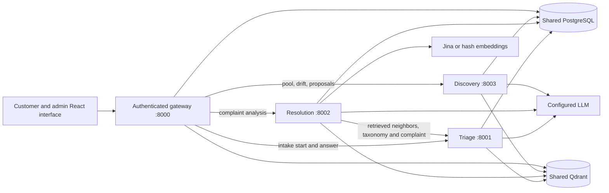

# Three-service architecture (optional deployment)

The Render demo still runs the original single-container configuration. Setting the three service URLs on the gateway enables a separate triage process, a separate resolution process, and a separate discovery process. Each has its own FastAPI application, HTTP contract, Dockerfile, health checks, and runtime. The gateway keeps authentication, tickets, routing persistence, incident updates, and the React interface. Empty service URLs retain the existing in-process behavior.



The three AI services run as independent processes and communicate through HTTP. They share the Python domain package because this is an incremental extraction; a service imports that shared package, never another service's FastAPI app or client internals. The gateway and the services currently share one PostgreSQL schema and Qdrant collections. This keeps the existing ticket, taxonomy, KB, and citation records consistent while the boundary is tested.

## Service responsibilities and contracts

| Process | Responsibility | Versioned endpoints |
|---|---|---|
| Triage | Adaptive intake; classify intent, product, severity, sentiment, and confidence using the live taxonomy, retrieved neighbors, intake evidence, rules, and LLM fallback | `POST /api/v1/triage`, `POST /api/v1/intake/start`, `POST /api/v1/intake/answer` |
| Resolution | Hybrid dense and sparse search, RRF, optional reranking, safe evidence expansion, cited step generation, citation validation, abstention, and routing | `POST /api/v1/resolve`, `POST /api/v1/resolve/stream` |
| Discovery | Drift calculation, unfamiliar-complaint pool, embedding clustering, LLM-assisted class proposals, admin decision, and taxonomy versions | `POST /api/v1/discovery/pool`, `GET /api/v1/discovery/pool`, `POST /api/v1/discovery/run`, `GET /api/v1/discovery/proposals`, `POST /api/v1/discovery/proposals/{id}/approve`, `POST /api/v1/discovery/proposals/{id}/reject`, `GET/POST /api/v1/taxonomy`, `POST /api/v1/drift/run`, `GET /api/v1/drift/history`, `POST /api/v1/drift/flag-kb/{id}` |

Each process also exposes `GET /health`, `GET /ready`, `GET /metrics`, and generated `/openapi.json`. `/health` checks process liveness. `/ready` checks its database and, where required, search index. The REST request and response schemas live in `src/telecom_assistant/microservices/`. For example, `/api/v1/resolve` accepts a complaint, optional intake and product hint, and a trace ID. Its response has the existing `triage`, `sources`, `draft`, `decision`, `models`, `degraded`, `warnings`, `query_vector`, `top_similarity`, `taxonomy_version`, and latency fields. The gateway's customer-safe source projection still controls what a customer sees.

## How one ticket flows

1. The gateway authenticates the customer, receives the complaint and intake answers, redacts personal information, and saves the ticket before analysis.
2. With `RESOLUTION_SERVICE_URL` set, the gateway posts the redacted complaint and trace ID to Resolution. The original in-process `SupportDesk.run_analysis` remains the comparison path when the URL is empty.
3. Resolution performs the existing dense and BM25 search over resolved tickets and published KB sections. It fuses ranks using RRF and applies the configured reranker where available.
4. Resolution sends the complaint, retrieved neighbors, kNN votes, intake evidence, and taxonomy version to Triage over HTTP. Triage runs the existing LLM classification and safety rules and returns its classification and metadata.
5. Resolution expands evidence and calls the existing resolver. It validates citations, removes unsupported steps, abstains on weak evidence, and applies the existing self-service/assisted/human routing policy. It returns the same analysis shape as the in-process path. For saved tickets, `/api/v1/resolve/stream` relays the original retrieval, triage, and drafting progress stages to the customer dashboard.
6. The gateway writes the result, customer-safe steps, citations, route, and trace to PostgreSQL. It can add an unfamiliar or low-confidence complaint to Discovery's pool. Incident Radar and ticket messages continue to run in the gateway.
7. An admin can run drift/discovery through authenticated gateway routes. Discovery computes statistics, clusters unfamiliar complaints, asks the LLM to name a possible new class, and waits for admin approval. Approval increments the shared taxonomy version; subsequent triage calls read the new class without retraining.

## Data and integrations

PostgreSQL remains the system of record: the gateway owns customer accounts, sessions, tickets, messages, events, steps, and incidents; Resolution reads resolved corpus and KB records; Triage reads taxonomy and optional retrieval evidence; Discovery reads and writes its pool, proposals, drift snapshots, taxonomy, and backfilled ticket intent. This is shared-schema access, not independent data ownership. The same Qdrant collections hold resolved-ticket and KB search points, with the existing indexer handling updates. The Compose example uses deterministic hash embeddings, which need no external key. All containers must use the same embedding model and dimension. For Jina embeddings, set `EMBED_PROVIDER=jina` and `JINA_API_KEY` for every process, then rebuild into a fresh Qdrant collection suffix.

The LLM provider keys are needed only by processes that call that provider. Triage uses classification, Resolution uses drafting, and Discovery uses proposal naming. The gateway still uses its LLM for Copilot, step chat, and learning, so it also receives keys during this migration. Redis/Upstash and Langfuse remain optional, as in the existing application. No QStash, OpenTelemetry collector, or Grafana service is added because those are not active dependencies in the current code.

## Configuration and Docker

The gateway reads `TRIAGE_SERVICE_URL`, `RESOLUTION_SERVICE_URL`, and `DISCOVERY_SERVICE_URL`. Resolution reads `TRIAGE_SERVICE_URL`. All four processes read the same `INTERNAL_SERVICE_TOKEN`; internal HTTP calls send it in `X-Service-Token`. Leave all service URLs empty to use the original deployment path. Database, Qdrant, model, embedding, and threshold variables retain their existing meanings; see `.env.example`.

From the repository root, set `INTERNAL_SERVICE_TOKEN` to a random secret in `.env`, then run:

```bash
docker compose config
docker compose up --build -d
docker compose exec api telecom-assistant seed --demo
docker compose ps
```

Open `http://localhost:8000`. Only the gateway publishes a host port. The Compose topology includes PostgreSQL and Qdrant, and persists them in named volumes. It does not need a Redis container because the app's Redis integration is Upstash REST and its offline fallback is in-process memory. Each service is buildable on its own from the repository root:

```bash
docker build -f services/triage/Dockerfile -t resolvedesk-triage .
docker build -f services/resolution/Dockerfile -t resolvedesk-resolution .
docker build -f services/discovery/Dockerfile -t resolvedesk-discovery .
```

For a hosted rollout, deploy the three images to private service endpoints, provide the corresponding URLs and shared token to the gateway, and keep the existing single-container deployment available until parity, availability, and data access have been checked in that environment. The existing `render.yaml` intentionally remains the working single-container deployment; this change does not silently redirect production traffic.

### Rollback

The previous single-container commit remains in Git history. If the new commit is deployed and needs to be undone, run `git revert <microservice-commit-sha>` on a clean `main` checkout and `git push origin main`. This creates a new commit restoring the previous code so a deployment tracking `main` can rebuild it. No database schema or data migration is introduced by this extraction. Stop any separately deployed AI services after traffic has returned to the previous gateway configuration.

## Failure behavior, security, and observability

- If a model fails during triage or drafting, the existing conservative rules, abstention, and escalation behavior still apply. If discovery's LLM cannot name a cluster, pooled complaints remain pending; no invented class is published.
- If Triage is unreachable, Resolution returns HTTP 503. If Resolution is unreachable, an already saved ticket is marked for human handling by the gateway. Other gateway calls to unavailable services return 503 rather than fabricated data.
- The gateway enforces customer/admin sessions and role checks. Internal processes are reachable only on the Compose network and require the service token on non-health endpoints. The token, provider keys, and database credentials belong in environment configuration, not source control. The resolution and triage endpoints redact complaints before external AI use.
- `X-Request-ID` follows the ticket trace ID from gateway to Resolution to Triage and is echoed in responses. Each service emits structured request-error logs without complaint bodies and exposes process counters and latency metrics at `/metrics`. Existing optional Langfuse traces remain in the LLM gateway.

## Verification and remaining migration work

`tests/test_microservices.py` compares the existing direct analysis with gateway-to-Resolution-to-Triage HTTP analysis for broadband, billing, fiber, and unfamiliar complaints. It compares classification, sources, draft steps and citations, routing, models, warnings, degraded flags, similarity, and taxonomy version; dynamic latency is excluded. Tests also cover internal-token rejection, service outage, Discovery and Drift contracts, and the degraded-LLM-to-admin-approval path. The existing unit and workflow tests still cover severity/P1 rules, hybrid retrieval, citation checks, abstention, learning, incidents, and customer/admin views.

This is an incremental extraction. Copilot, step chat, incident radar, KB editing, learned-case indexing, ticket persistence, customer/admin APIs, evaluation jobs, and some index maintenance still execute in the gateway. Discovery and the gateway also access the shared taxonomy repository directly. Each service currently constructs the shared `Services` composition root, including some components it does not use; narrowing those constructors is future work. Provider quotas held only in memory are per process unless a shared Upstash cache is configured. Cross-process search requires a shared Qdrant backend; separate in-memory indexes are suitable only for isolated tests. A production rollout still needs environment-specific private networking, database migrations, monitoring/scraping configuration, and a real container smoke test.
